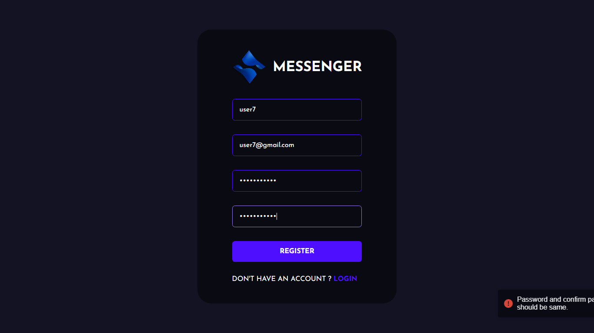

# Messenger

Visit: [https://uv-messenger.netlify.app/](https://uv-messenger.netlify.app/)
Welcome to Messenger! This is a simple chat application built using MERN Stack [MongoDB, Express, Socket.io, React]. The application allows users to chat with other users, also users can set avatars on their profile which gives them a unique identity. It is designed to provide a seamless and interactive chatting experience for users.

## Features

- User registration and authentication
- Avatar on user profile
- User profile customization
- Real-time messaging
- Emojis attachments
- Message notifications
- Privacy and security features

## Technologies Used

- React, Node.js, Socket.io, MongoDB
- react-toastify, emoji-picker-react, styled-components

## Installation

1. Clone the repository:

2. Navigate to the project directory:

3. Install the dependencies:

4. Configure the application by updating the necessary environment variables (if applicable).

5. Start the application:

6. Open your web browser and visit [http://localhost:3000](http://localhost:3000) to access the chat application.

## Usage

- Register a new account or log in with existing credentials.
- Explore the chat interface.
- Send messages to other users.
- Customize your profile settings.
- Add Avatar on your profile.
- Enjoy seamless and interactive conversations!

## Screenshots

## Contributing

Contributions are welcome! If you'd like to contribute to The App, please follow these steps:

1. Fork the repository.
2. Create a new branch for your feature or bug fix.
3. Make the necessary changes and commit them.
4. Push your changes to your fork.
5. Submit a pull request to the main repository.

Please ensure that your code follows the project's coding guidelines and includes appropriate tests (if applicable).

## Contact

If you have any questions, suggestions, or feedback, please feel free to reach out to Email: utkarshv955@gmail.com. We'd love to hear from you!

Happy chatting!
